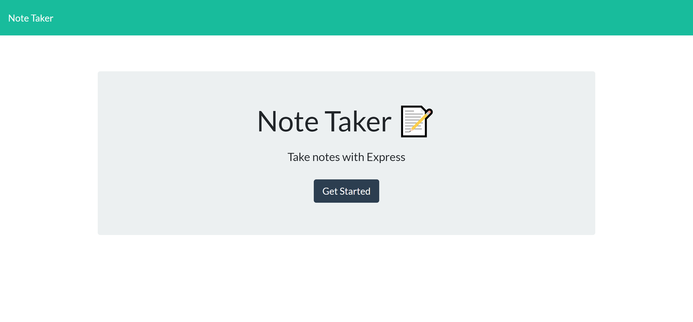
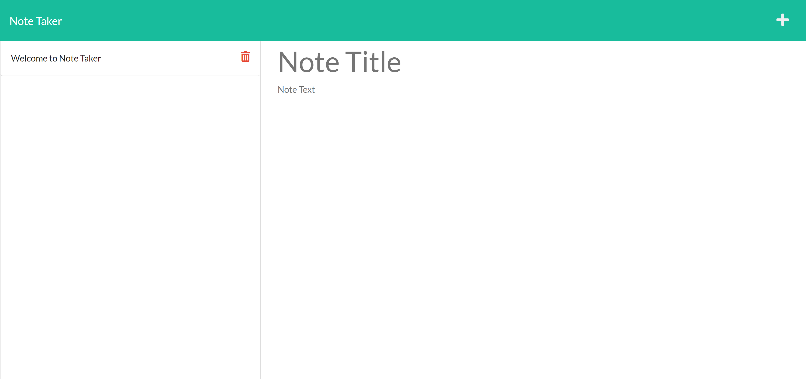

## **Table of Contents**

1.  [Description](#introduction)
2.  [Technologies Used](#technologies-used)
3.  [Packages Used](#packages-used)
4.  [User Flow](#user-flow)
5.  [Invoke Application](#invoke-application)
6.  [Tests](#tests)
7.  [Demo](#demo)

## **Description**

In this project, I have been tasked to build the back-end of "Note Taker" application using `Express.js`. This application will allow users to add notes to a planner, and refer back to it in the future when needed.

For the back-end, I have created the necessary routes and controller functions in order to ensure the paths were correct for the site to function on the back-end. This application is deployed to Heroku, you can visit the deployed application here: https://still-taiga-68575.herokuapp.com/notes

## **Technologies Used**

- HTML
- CSS
- Bootstrap
- JavaScript
- Node.js
- Express.js

## **Packages Used**

- Express
- UUID
- Nodemon (dev)

## **User Flow**

GIVEN a note-taking application

WHEN I open the Note Taker

THEN I am presented with a landing page with a link to a notes page

WHEN I click on the link to the notes page

THEN I am presented with a page with existing notes listed in the left-hand column, plus empty fields to enter a new note title and the note’s text in the right-hand column

WHEN I enter a new note title and the note’s text

THEN a Save icon appears in the navigation at the top of the page

WHEN I click on the Save icon

THEN the new note I have entered is saved and appears in the left-hand column with the other existing notes

WHEN I click on an existing note in the list in the left-hand column
THEN that note appears in the right-hand column

WHEN I click on the Write icon in the navigation at the top of the page

THEN I am presented with empty fields to enter a new note title and the note’s text in the right-hand column

## **Invoke Application**

```
git clone git@github.com:DarionRichards/note-taker.git
npm i
npm run start
```

## **Tests**

Tests were not required.

## **Demo**

### Index.html



### Notes.html


